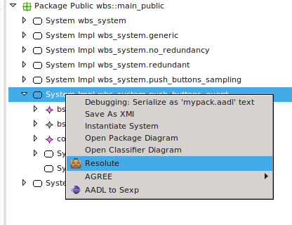
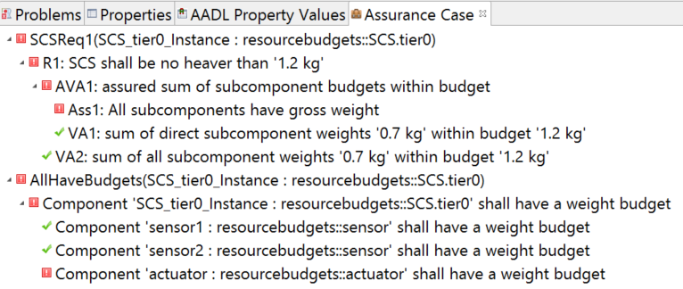
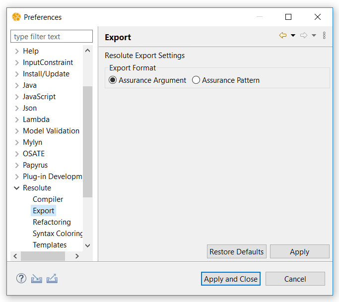
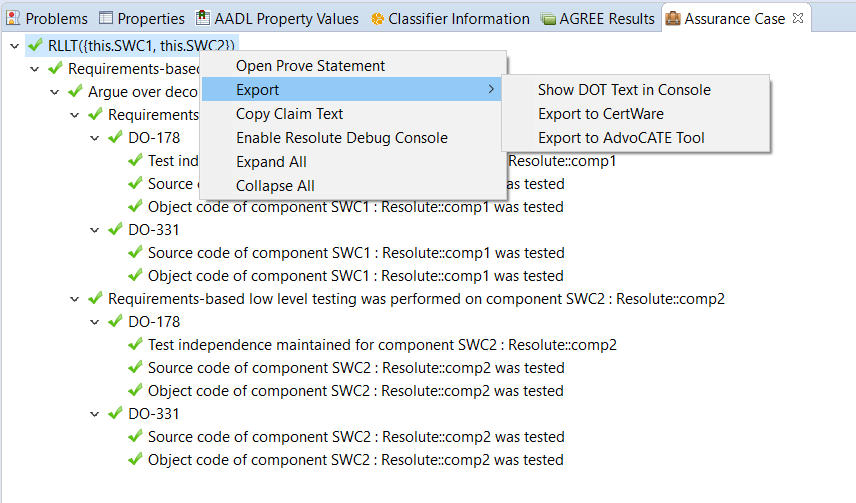
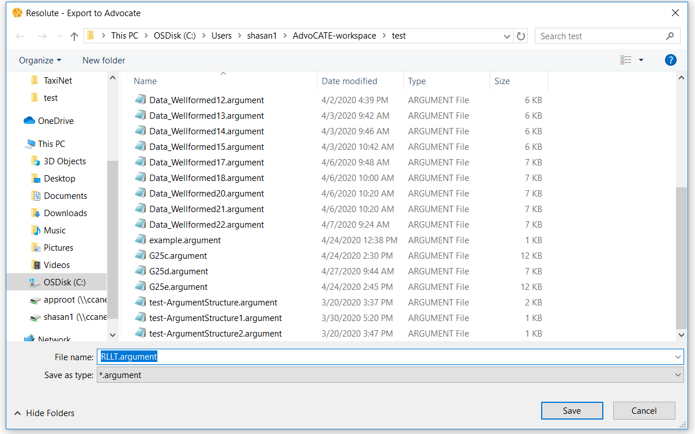
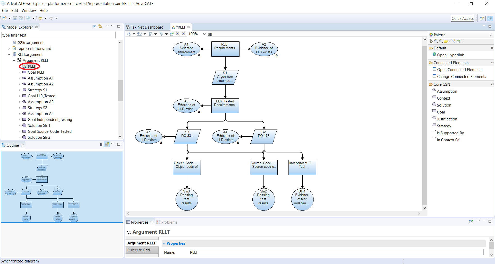

Introduction
============

Resolute allows users to define a set of claim functions and associate
them with an AADL model. You can use these claim functions to represent
the requirements to be satisfied, the verification actions used to
verify them, and assumptions made by a verification action in order to
produce a valid result. You will express the requirements as predicates
on subrequirements and verification actions. Verification actions invoke
Boolean computational functions to represent predicates to be evaluated
and general computational functions to compute values to be compared in
predicates. The computational function notation has its roots in Lute
and REAL. You can organize claim functions into a hierarchy where a
claim function is satisfied only if its subclaim functions are satisfied
according to the specified predicate logic.

Throughout this document, we use an example of resource budget analysis,
in particular, an analysis of weight. The full example is available on
the [OSATE pages at
GitHub](https://github.com/osate/examples/tree/master/core-examples/resolute).

With the Resolute tool, users define claim functions and computational
functions in Resolute annex libraries, *i.e.*, Resolute annex clauses
placed directly in an AADL package. The example below shows a claim
function called `SCSReq1` that represents a requirement and consists of
two verification actions. At least one of them must be satisfied for the
requirement to be satisfied (expressed by `or`). The example also
shows a computational function that calculates the sum of budgets of all
direct subcomponents. Finally, the example shows a global constant
definition that a user can reference in a Resolute library or Resolute
subclause. Here, we use it to specify the maximum weight, against which
the verification actions will compare the total.

~~~ {.aadl caption="BudgetCase Example"}
package BudgetCase
public

annex Resolute {**
    MaximumWeight : real = 1.2kg

    SCSReq1(self : component) <=
    ** "R1" SCS shall be no heavier than " MaximumWeight%kg **
    SCSReq1VA1(self, MaximumWeight) or SCSReq1VA2(self, MaximumWeight)

    AddBudgets(self : component) : real =
    sum([WeightBudget(t) for (t: subcomponents(self))])
~~~

Users then associate the claim functions representing requirements with
component types or implementations by `prove` statements declared in
Resolute annex subclauses. The example shows the `prove` statement for
`SCSReq1` with the component itself passed in as a parameter.

~~~ {.aadl caption="Prove Statement for a Claim Function"}
system implementation SCS.Phys
    subcomponents
        sensor1: device sensor;
        sensor2: device sensor;
        actuator: device actuator;
    annex Resolute {**
        prove (SCSReq1(this))
~~~

Users invoke the *Resolute* command on a component implementation. This
results in an instantiation of the component implementation and the
application of all claim functions associated with all of the components
in the instance model via the `prove` statements.

The verification results are then displayed in a view labeled *Assurance
Case.* For each claim function invoked by a `prove` statement,
Resolute evaluates any claim function called by the claim function
expression.

Currently, each `prove` statement is shown at the top level of the
Assurance Case view. This is the case for different `prove` statements
of the top-level component as well as any subcomponent that has
`prove` statements.

Claim Functions
===============

Claim functions can represent requirements, verification actions, and
assumptions. There is currently no syntactic distinction in their use.
This section describes conventions that users should follow to
distinguish the different uses.

Claim functions have a name, zero or more parameters, a description, and
a predicate expression. The claim function has a return type of Boolean
(true to represent success and false to represent failure). The syntax
of a claim function is as follows:

~~~ {.bnf caption="Claim Function Syntax"}
<Claim_Function> ::=

    <name> "(" (<parameter> ("," <parameter) )* )? ")" "<="
    "**" <description> "**" <claim_function_expression>

<parameter> ::= <name> ":" <type>

<description> ::= <text> ( <parameter_reference> | <text>)*
~~~

Parameters typically represent the model elements to which the claim
function applies and values used in the predicate expression to
determine whether the predicate is satisfied. The parameter declaration
consists of a name and a type (for more information, see the Resolute
Type System section in the *Resolute Language Reference*).

The description can be a combination of strings and parameter
references; it explains the role of the claim function and is displayed
as part of the result in the Assurance Case view. The description for a
claim function consists of a sequence of strings and references to claim
function parameters, global constants, or local constants (defined by
`let` statements). If the values are numerical with a unit, you can
specify the unit to be used for display by indicating the desired unit
after a `%`, *e.g.*, `WeightLimit%kg`. The units are those defined by
Units property types in AADL property sets and do not have to be
qualified by the Units type.

The evaluation of the predicate determines the success (true return
value) or failure (false return value) of the claim function. The claim
function expression is assumed to be a logical expression (`and`,
`forall`, `or`, `exists`, `andthen`) to represent a predicate.
In the case of `and` and `forall`, all expression elements are
executed and then the result is evaluated and returns true only if all
claim functions return true. Executing all claim functions allows
Resolute to inform the user of all failing claim functions rather than
one at a time by not executing the remaining elements in the `and` or
`forall` expression. The `andthen` operator allows users to specify
that the right-hand claim function should only be executed if the
left-hand claim function returns true.

Resolute Libraries of Claim Functions
-------------------------------------

Users define claim functions in Resolute annex libraries. Declare a
Resolute annex library directly in a package through the `annex`
Resolute `{**` \<library content\> `**};` statement. You can
place this statement in a package by itself, combine it with library
declarations for other annexes, or combine it with classifier
declarations in the same package. A package cannot contain multiple
Resolute annex library declarations; each library must be placed in a
separate package.

Note: Resolute assumes a global name space for the names of claim
functions and computational functions. Therefore, their names must be
globally unique. You can reference them in `prove` statements, other
claim functions, or computational functions without qualification by a
package name.

Application of Claim Functions
------------------------------

Invoke a claim function on a component by specifying a `prove`
statement in a Resolute annex subclause of the component implementation.
The Resolute subclause of a component implementation can contain
multiple `prove` statements. This claim function is then executed on
every instance of this component implementation when the *Resolute*
command is invoked.

When you have a system with subsystems, you can associate claim
functions with each component implementation in the system hierarchy.
The verification of this claim will then be performed for each instance
of the component implementations with a `prove` statement. Typically,
you have `prove` statements for the top-level system that involve
verifying the system across multiple layers, *e.g.*, performing resource
budget analysis across the whole system. You may also perform
compositional verification by verifying a component with respect to its
direct subcomponents. In this case, you place a `prove` statement at
each layer, *i.e.*, with each component implementation of components
involved in the system. We illustrate this capability with our resource
budget analysis, by analyzing budgets of direct subcomponents against
the specified budget limit for each layer of the architecture.

Note: A `prove` statement cannot be declared for a component type. A
declaration with the component type would mean that it applies to all
instances of all implementations.

The parameter values can be integers, real numbers, strings, Boolean
literals, model elements, references to global constants, and
collections of these types. They must match the specified type for the
parameter.

One special model element reference is expressed by the keyword
`this`. It refers to the instance model object of the model element
that contains the `prove` statement. The keyword `this` can only be
used in the `prove` statement --- not in verification action expressions.
This constraint means that `this` must be passed to a claim function
for it to know what model element it operates on --- unless you have a
global claim function (see Global Constants).

~~~
    prove ( Memory_safe ( this ))
~~~

You can also identify a subcomponent of `this`; *i.e.*, associate the
verification action with a component down a path of the architecture
hierarchy. This allows you to specify a verification action for a
specific component instance. This example shows how a `prove`
statement is applied to a subcomponent called subsystem1:

~~~
    prove ( Fully_Connected ( this.subsystem1 ))
~~~

The `prove` statement can be associated with the component classifier
of the subcomponent. In this case, it applies to all instances of that
component. We recommend that you associate `prove` statements with a
path only if the `prove` is intended for that particular instance of a
subcomponent.

Uses of Claim Functions
-----------------------

The compiler does enforce that claim functions can be invoked only in
`prove` statements, and as operands in `and`, `or`, `andthen`, `orelse`,
`exists`, and `forall` operations, and cannot be invoked in
computational functions.

### Claim Functions as Requirements to Be Satisfied

Users can represent a requirement with a claim function and associated
it with an implementation of a system using the `prove` statement, as
shown in this example for a system called `SCS`.

~~~
    prove (SCSReq1(this))
~~~

The description of the claim function representing the requirement may
include a requirement identifier as part of the text, as shown in the
next example.

Global constants specify values in requirements that users tend to
change. This allows you to localize the change to a single location. In
our example, we reference a Resolute global constant `MaximumWeight` to
indicate the desired limit in the descriptive text, as parameters to
other claim functions and computational functions, and in predicate
expressions.

The expression specifies the verification actions whose results are used
as evidence that the requirement has been met. In the example below, we
show a verification action that assures the subcomponent weight budget
totals are within the limit and a verification action that recursively
adds the actual weights.

The first verification action illustrates compositional verification of
weights in terms of the budgets at the next lower level, while the
second always takes into account all actuals. Note that the first
analysis is not affected by a lower level change as long as the budget
of its enclosing component is not exceeded, while the second analysis is
affected by every change in weights throughout the whole system.

~~~{.resolute caption="MaximumWeight Claim Function Example"}
-- requirement expressed in terms of the Maximum weight constant
SCSReq1(self : component) <=
** "R1: SVS shall be no heavier than " MaximumWeight%kg **
    SCSReq1AssureSubcomponentSubtotals(self, MaximumWeight)
    and SCSReq1AssureRecursiveTotals(self, MaximumWeight)
~~~

Because we have already specified the weight limit as a property in the
AADL model, we can reference it to be supplied as a value to the
verification action, as shown below.

~~~
    SCSReq1AssureSubcomponentTotal(self, property(self, SEI::WeightLimit))
~~~

In addition, we can add a verification action to verify that the
property and the global constant have the same value.

~~~
    SCSReq1AssureWeightLimitProperty(self, property(self, SEI::WeightLimit), MaximumWeight)
~~~

A requirement may be specified vaguely such that it cannot be verified.
In this case, you may need to refine the requirement into
subrequirements that are verifiable. Do this by listing claim functions
representing the subclaims in the claim function expression of the
original requirement.

The claim function expression in a "requirement" claim function may
contain `and`, `forall`, `andthen`, `or`, `orelse`, or `exists`.

The `and` and `forall` expressions indicate that all operands are
evaluated; the claim is then true if all operands return `true`. This
means that all claim functions or Boolean computational functions are
executed independently of whether they return true or false. Once all
have been executed, the expression returns `true` only if all operands
are `true`. This allows Resolute to report to the user all failing
operands rather than aborting after the first failing one and requiring
the user to correct it before finding out that others fail as well.

-   The `or` and `exists` indicate alternative sets of verification
    actions. The operands are executed and the results are evaluated in
    order; the first returning `true` determines true for the claim.
    Effectively the user specifies that the right-hand operand is
    executed only if the left-hand operand fails. This allows you to
    specify an alternative way of verifying a claim if one verification
    action is not successful. You can also use it to specify a `fail`
    statement as the right-hand operand to provide a special message for
    a failing left-hand operand.

-   The `andthen` expression executes the left-hand operand first. If
    it fails, the whole expression is considered as failing (returns
    `false`), i.e., the right hand is not executed. If the left returns `true`, the right-hand side is
    executed and its result value becomes the value of the `andthen`
    expression. This allows users to specify that certain claim
    functions, such as verification actions, should be executed only if
    preceding verification actions pass.

-   The `orelse` expression executes the left-hand operand first. If
    it evaluates to `true`, the whole expression is considered as passing (returns
    `true`), i.e., the right-hand is not executed. If the left returns `false`, the right-hand side is
    executed and its result value becomes the value of the `orelse`
    expression. This allows users to specify that the right operand should be executed as alternative, e.g., to execute the `fail` construct or the built-in `debug` function.

Note: Resolute allows computational expressions to be mixed with
subclaim functions in a claim function expression. Unfortunately, the
results of their evaluation are not shown in the Assurance Case view.
This leads to the scenario where all subclaims are shown as satisfied
(`true`), but the claim itself is shown as failed because the
computational constraint expression evaluates to `false`. Therefore,
we recommend that users not mix subclaims and computational expressions.

### Claim Functions as Verification Actions

Claim functions also represent verification actions, whose execution
produces a verification result as evidence. You can associate
verification actions with a requirement by calling them in the claim
function expression of the claim function representing the requirement,
as shown earlier.

For a claim function that represents a verification action, the
expression represents the predicate to be evaluated in order for the
verification action to pass. One of the elements of the predicate
typically is a constraint value to be met, and the other is a
computational function call or reference to a computational result to
compare. In the next example, the verification action computes the sum
of the subcomponent budgets and compares them to the maximum.
`AddSubcomponentWeightBudgets` is a computational function that returns
a `real` value.

Note: The identifier `VA1` is added into the description text by
convention.

If we want to produce a special error message for a failing verification
condition, we can use the `orelse` operation with a `fail` statement as
the right-hand side. Failure of the left-hand side results in the
execution of the right-hand side; *i.e.*, this operation effectively
throws a fail exception with the specified description text, which is
then associated with the enclosing claim function.

~~~ {.resolute caption="Fail statement example"}
SCSReq1VA1VerifySubcomponentTotals(self : component, max : real) <=
** "VA1: sum of direct subcomponent weights " actuals%kg " within budget " max%kg **
let actuals : real = AddSubcomponentWeightBudgets(self);
(actuals <= max) orelse fail ** self " weight sum " acutals%kg "over budget " maxkg **
~~~

### Verification Assumptions and Preconditions

Verification actions may make

-   assumptions that must hold for the verification action result to be
    accurate

-   preconditions that must hold in order for the verification action to
    be executed

A use case for a verification action assumption is that the calculation
of the weight totals can be performed even though some components may
not yet have a weight budget. However, it is still useful to evaluate
the partial weight total result as it may already be close to or exceed
the limit. This allows Resolute to inform the user without first
requiring the user to complete the model with missing weight budget
properties. The `assumption` function will determine how many
components have a weight budget and report the percentage of components
with a weight budget.

The following example illustrates a verification action with an
assumption. We have a claim function that models the assumption to be
evaluated, called `SCSReq1SubcomponentsHaveWeight`. It counts the number
of components and those with a `GrossWeight` property and generates a
fail message with the percentage of components with a weight property.

We then use this claim function in a new claim function that executes
both the assumption claim function and the claim function representing
the actual verification by adding the subcomponent weight budgets that
we defined earlier (`SCSReq1VA1VerifySubcomponentTotals`). The `and`
operator allows both assumption and verification action claim functions
to be evaluated.

~~~ {.resolute}
SCSReq1AssureSubcomponentTotals(self : component, max : real) <=
** "AVA1: assured sum of subcomponent budgets within budget" **
-- we only evaluate the weight total if subcomponents have weight budget
SCSReq1VA1SubcomponentsHaveWeight(self) and SCSReq1VA1VerifySubcomponentTotals(self, max)
~~~

~~~ {.resolute}
SCSReq1VA1SubcomponentsHaveWeight(self : component) <=
** "Ass1: All subcomponents have gross weight" **
let ratio : int = SubcomponentWeightBudgetCoveragePercent(self);
forall (sub : subcomponents(self)) . has_property(sub, SEI::GrossWeight)
orelse fail ** "Percentage of subcomponents with weight " ratio " percent" **
~~~

A use case for a verification action precondition is that the
verification action cannot perform the analysis until all the data is
present; *i.e.*, all components involved in the computation have
appropriate property values. In this case, we use the `andthen`
operator instead of `and`.

Global Claim Functions
----------------------

Claim functions can be defined without parameter. In this case, the
claim function first queries the instance model for objects and then
applies a claim function to each element of the query. The query is
accomplished by identifying a collection of model elements and then
applying a claim function to each element of the collection using
`forall` or `exists`. Model element collections can be identified by
category, *e.g.*, by `threads` for all threads in the instance model or
by set constructors such as `instances`(classifier), which returns all
component instances of the specified classifier. Collections and their
operations are discussed in detail in the *Resolute Language Reference*.

The example shows a global constraint that all threads must have a
period property value.

~~~{.resolute}
SystemWideReq1() <= ** "All threads have a period" **
forall (t : thread) . HasPeriod(t)

HasPeriod(t : thread) <= **Thread " t " has a period" **
has_property(t, Timing_Properties::Period)
~~~

You can include global claim functions as `prove` statements on any
model element, since they query the whole model independently of a
specific model element. However, you should place them in the top-level
component implementation to which the *Resolute* command is applied;
otherwise, they may be invoked multiple times.

Export to AdvoCATE
==================

Resolute provides the ability to export an evaluated assurance argument to the AdvoCATE graphical assurance case tool. Both *assurance patterns* and *assurance arguments* can be exported.  An *assurance pattern* collapses multiple instances of assurance argument elements into a single element.  The export format of a Resolute assurance case can be specified by clicking the *Windows -> Preferences* menu item, then choosing the *Resolute -> Export* preference page.

To export the assurance case, from the *Assurance Case* tab in OSATE right click on the top-level goal as shown below.

From the pop-up menu, select *Export -> Export to AdvoCATE Tool*.  A *Resolute – Export to Advocate* dialog box will open (as shown below). Navigate to an AdvoCATE workspace folder (you may wish to create a new AdvoCATE project first if it does not already exist, but this is not required).  Enter a file name and select *Save*.  This will generate a *.argument* file that can be imported directly into AdvoCATE.

Open AdvoCATE and refresh the project where the .argument file is located. Next, open the exported file using the diagram representation in AdvoCATE to visualize the generated export. Expand the *.argument* filename in the *Model Explorer* pane and double-click the argument (marked with the red oval in the figure below) to visualize the assurance pattern in AdvoCATE. 

Debugging Resolute
==================

Look in the appropriate section of the Resolute reference manual for debug tracing support.

[]{#copyright}

Copyright
=========

Copyright 2015 Carnegie Mellon University

This material is based upon work funded and supported by the Department
of Defense under Contract No. FA8721-05-C-0003 with Carnegie Mellon
University for the operation of the Software Engineering Institute, a
federally funded research and development center.

Any opinions, findings and conclusions or recommendations expressed in
this material are those of the author(s) and do not necessarily reflect
the views of the United States Department of Defense.

NO WARRANTY. THIS CARNEGIE MELLON UNIVERSITY AND SOFTWARE ENGINEERING
INSTITUTE MATERIAL IS FURNISHED ON AN "AS-IS" BASIS. CARNEGIE MELLON
UNIVERSITY MAKES NO WARRANTIES OF ANY KIND, EITHER EXPRESSED OR IMPLIED,
AS TO ANY MATTER INCLUDING, BUT NOT LIMITED TO, WARRANTY OF FITNESS FOR
PURPOSE OR MERCHANTABILITY, EXCLUSIVITY, OR RESULTS OBTAINED FROM USE OF
THE MATERIAL. CARNEGIE MELLON UNIVERSITY DOES NOT MAKE ANY WARRANTY OF
ANY KIND WITH RESPECT TO FREEDOM FROM PATENT, TRADEMARK, OR COPYRIGHT
INFRINGEMENT.

This material has been approved for public release and unlimited
distribution.

DM-0003006
